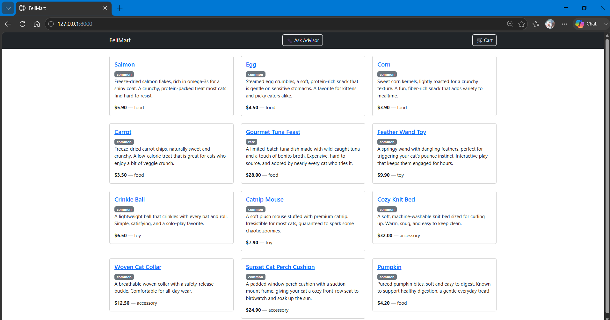
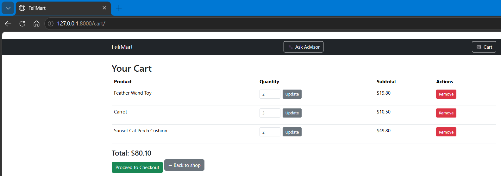
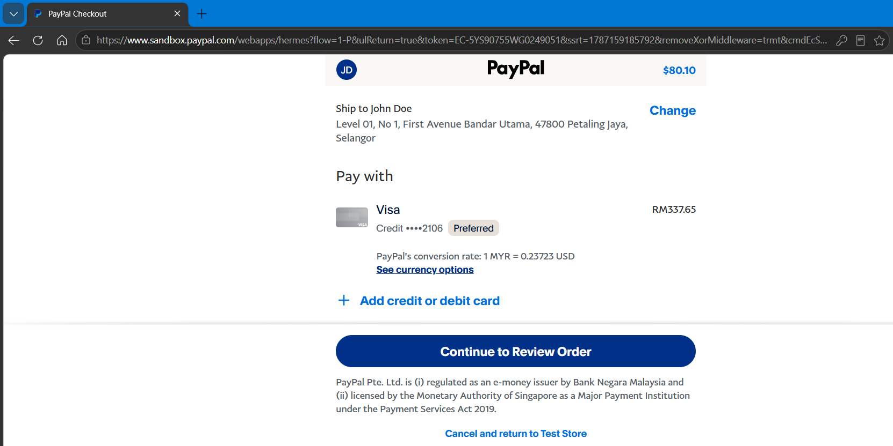
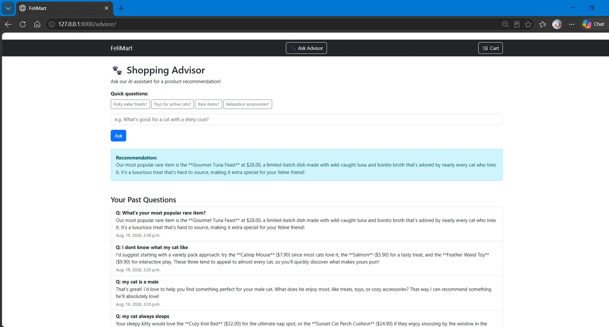

# FeliMart 🐾

A full-stack Django e-commerce web app built as a companion project to [AnimaFelis](https://github.com/AzuMaooo/AnimaFelis), a cat-themed virtual pet game.

> **Note:** FeliMart shares a visual theme with AnimaFelis but is a technically separate project (Django/PostgreSQL web app vs. Unity/C# mobile game). It was built to close a specific skills gap for backend-focused internship roles.

## Features

- **Product catalog** with category and rarity filtering (food, toy, accessory)
- **Session-based shopping cart** with add, remove, and quantity update functionality
- **User authentication** via Django's built-in auth system
- **Order system** with a real `Order`/`OrderItem` database model, order confirmation flow, and status tracking (pending, paid, cancelled)
- **PayPal Sandbox integration** for a complete, real checkout and payment flow
- **AI Shopping Advisor** powered by the Anthropic API, giving product recommendations grounded in FeliMart's actual catalog (not hallucinated suggestions), with persistent per-user question history and quick-suggestion FAQ buttons
- **Django admin panel** for product management

## Screenshots

### Storefront
<!-- Add a screenshot of your product list page here -->


### Shopping Cart
<!-- Add a screenshot of your cart page with items in it -->


### Order Confirmation & PayPal Checkout
<!-- Add a screenshot of the order confirmation page and/or PayPal sandbox checkout -->


### AI Shopping Advisor
<!-- Add a screenshot of the advisor page with a recommendation shown -->


## Tech Stack

- **Backend:** Django 6.1 (Python)
- **Database:** PostgreSQL
- **Frontend:** Django Templates, Bootstrap 5
- **Payments:** PayPal Sandbox (via `paypalrestsdk`)
- **AI:** Anthropic API (Claude), for the shopping advisor feature
- **Environment management:** `python-decouple` for secure credential handling via `.env`

## Project Structure

```
felis_mart/
├── felis_mart/          # Project settings, root URLs
├── store/                # Main app
│   ├── models.py         # Product, Order, OrderItem, AdvisorHistory
│   ├── views.py           # All view logic
│   ├── urls.py             # App-level routing
│   ├── management/
│   │   └── commands/
│   │       └── seed_products.py   # Seeds 12 starter products
│   └── templates/store/    # HTML templates
└── manage.py
```

## Setup Instructions

1. Clone the repo and create a virtual environment:
   ```bash
   git clone https://github.com/AzuMaooo/FeliMart.git
   cd FeliMart
   python -m venv venv
   venv\Scripts\activate  # Windows
   ```

2. Install dependencies:
   ```bash
   pip install -r requirements.txt
   ```

3. Create a `.env` file in the project root with:
   ```
   DB_NAME=felismart
   DB_USER=your_db_user
   DB_PASSWORD=your_db_password
   DB_HOST=localhost
   DB_PORT=5432
   PAYPAL_CLIENT_ID=your_paypal_sandbox_client_id
   PAYPAL_SECRET=your_paypal_sandbox_secret
   PAYPAL_MODE=sandbox
   ANTHROPIC_API_KEY=your_anthropic_api_key
   ```

4. Set up PostgreSQL and run migrations:
   ```bash
   python manage.py migrate
   python manage.py seed_products
   python manage.py createsuperuser
   ```

5. Run the development server:
   ```bash
   python manage.py runserver
   ```

## Project Status

FeliMart is under active development. Core storefront, cart, checkout with PayPal Sandbox, and the AI shopping advisor are complete and fully functional. Remaining work includes a formal Django test suite and AWS deployment (RDS, EC2/Elastic Beanstalk, S3).

## Skills Demonstrated

- Django ORM, models, and migrations
- PostgreSQL setup, raw SQL (SELECT, JOIN, GROUP BY), schema/permission troubleshooting
- Session management and secure credential handling (`python-decouple`)
- Third-party API/SDK integration (PayPal REST SDK, Anthropic API)
- Django authentication and view-level authorization (`@login_required`, ownership checks)
- Template inheritance, Bootstrap-based responsive UI
- Git version control with a clean commit history
